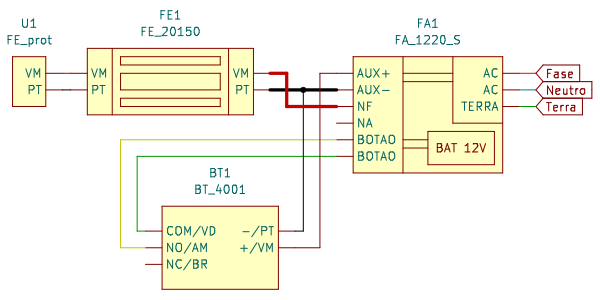

# Intelbras KiCad lib

Biblioteca de símbolos de produtos Intelbras para [KiCad 6][kicad], um programa
de desenho de esquemas elétricos. Desenvolvida para documentação de sistemas
instalados e planejamento de instalações.

## Símbolos disponíveis

- [BT 4001][bt4001]: acionador de abertura infravermelho
- [BT 5000][bt5000]: acionador de abertura
- [FA 1220 S][fa1220s]: fonte de alimentação ininterrupta com temporização
- [FE 20150][fe20150]: fechadura eletroímã 150 kgf sem sensor
- [FE 20150 sensor][fe20150]: fechadura eletroímã 150 kgf com sensor
- [FE prot][fe20150]: circuito de proteção para fechadura eletroímã
- [SS 420][ss420]: controlador de acesso corporativo
- [SS 3430 BIO][ss3430]: controlador de acesso corporativo
- SS RJ45: conector RJ45 para controlador de acesso corporativo

[kicad]: <https://www.kicad.org/>
[bt4001]: <https://www.intelbras.com/pt-br/acionador-de-abertura-infravermelho-bt-4001>
[bt5000]: <https://www.intelbras.com/pt-br/acionador-abertura-inox-embutir-42-bt-5000-in>
[fa1220s]: <https://www.intelbras.com/pt-br/fonte-de-alimentacao-ininterrupta-fa-1220-s-com-bateria>
[fe20150]: <https://www.intelbras.com/pt-br/fechadura-eletroima-150-kgf-universal-fe-20150>
[ss420]: <https://www.intelbras.com/pt-br/controlador-de-acesso-125khz-ss-420>
[ss3430]: <https://www.intelbras.com/pt-br/controlador-de-acesso-rfid-125-khz-ss-3430-bio>
